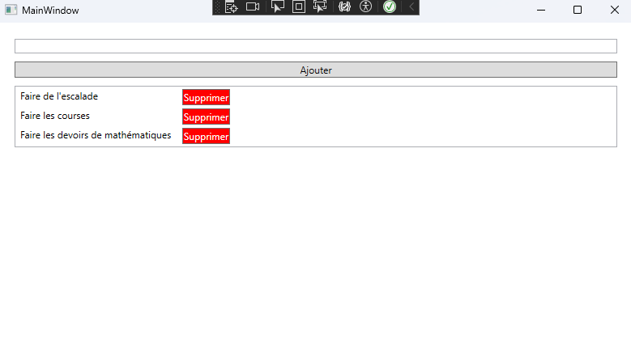

# TaskManager — Desktop (C# / .NET / WPF)

Desktop application for the TaskManager project, built with WPF and .NET.

This app lets you manage daily tasks through a simple graphical interface: create tasks, list them, and delete them. Data is persisted locally with SQLite via Entity Framework Core.



## Features

* Desktop GUI (WPF)
* Create and delete tasks
* Task list bound to the UI (MVVM)
* Local persistence with SQLite
* Entity Framework Core migrations applied automatically on startup
* Layered architecture (views, view models, services, data access)
* `RelayCommand` for button actions

## Tech Stack

| Component | Version / Detail |
| --------- | ---------------- |
| C# | — |
| .NET | 10.0 (Windows) |
| WPF | — |
| Entity Framework Core | 10.0.5 |
| SQLite | via `Microsoft.EntityFrameworkCore.Sqlite` |
| MVVM | manual (`INotifyPropertyChanged`, commands) |

## Project Structure

```
TaskManagerSoftware-DotnetCore/
├── docs/
│   └── screenshots/
│       └── desktop.png                  # App screenshot (README)
├── TaskManagerApp/
│   ├── App.xaml                         # Application entry (WPF)
│   ├── App.xaml.cs                      # Startup + EF migrations
│   ├── Commands/
│   │   └── RelayCommand.cs              # ICommand implementation
│   ├── Data/
│   │   ├── AppDbContext.cs              # EF Core DbContext
│   │   └── DBContextFactory.cs          # SQLite connection factory
│   ├── Migrations/                      # EF Core migrations
│   ├── Models/
│   │   └── TaskModel.cs                 # Task entity
│   ├── Services/
│   │   ├── ITaskService.cs              # Service contract
│   │   └── TaskService.cs               # CRUD (read, add, delete)
│   ├── ViewModels/
│   │   └── MainViewModel.cs             # Main screen logic (MVVM)
│   ├── Views/
│   │   ├── MainWindow.xaml              # Main UI
│   │   └── MainWindow.xaml.cs
│   └── TaskManagerApp.csproj
└── TaskManagerApp.slnx
```

## Getting Started

### Prerequisites

* **Windows** (WPF targets `net10.0-windows`)
* **[.NET 10 SDK](https://dotnet.microsoft.com/download)** installed and available in your `PATH`

Verify your installation:

```bash
dotnet --version
```

### Installation

```bash
git clone https://github.com/Ev0gs/TaskManagerSoftware-DotnetCore.git
cd TaskManagerSoftware-DotnetCore
```

### Run the application

From the repository root:

```bash
dotnet run --project TaskManagerApp
```

**With Visual Studio:**

1. Open `TaskManagerApp.slnx`
2. Set `TaskManagerApp` as the startup project
3. Press **F5** (Debug) or **Ctrl+F5** (Run without debugging)

On first launch, EF Core applies pending migrations and creates the SQLite database file (`tasks.db`) next to the built executable.

### Build

```bash
dotnet build TaskManagerApp
```

### Publish (optional)

```bash
dotnet publish TaskManagerApp -c Release -r win-x64 --self-contained false
```

The published output includes `tasks.db` in the output folder after the app has been run at least once.

## Data Model

### `TaskModel` (entity)

| Field | Type | Description |
| ----- | ---- | ----------- |
| `Id` | `int` | Primary key (auto-generated) |
| `Title` | `string` | Task title (required) |
| `Description` | `string` | Optional description |
| `DueDate` | `DateTime` | Due date |
| `IsCompleted` | `bool` | Completion flag |

New tasks created from the UI receive a default due date (tomorrow) and `IsCompleted = false`. The `Description` field is reserved for future UI support.

## SQLite Database

| Parameter | Value |
| --------- | ----- |
| Provider | SQLite |
| File | `tasks.db` (created in the application output directory) |
| Migrations | Applied automatically in `App.OnStartup` |

To add a new migration after model changes:

```bash
dotnet ef migrations add <MigrationName> --project TaskManagerApp
```

## Related Projects (Web)

This repository is the **desktop** variant of the TaskManager ecosystem. The web stack uses the same task concept with a REST API and an Angular frontend:

| Repository | Role |
| ---------- | ---- |
| [TaskManagerWebapp-Backend-Java-Spring](https://github.com/Ev0gs/TaskManagerWebapp-Backend-Java-Spring) | REST API (Spring Boot, H2) |
| [TaskManagerWebapp-Frontend-Angular](https://github.com/Ev0gs/TaskManagerWebapp-Frontend-Angular) | Web UI (Angular) |

The desktop app does not call the Spring API; it uses its own local SQLite database.

## Running Tests

Unit tests are not included in this repository yet. See **Future Improvements**.

## Future Improvements

* Update tasks and toggle completion from the UI
* Edit `Description` and `DueDate` in the form
* Unit tests (view models, services)
* Dependency injection for services and `DbContext`
* Packaging (MSIX / installer)
* Optional sync with the Spring Boot REST API
* Categories, priorities, and filtering

## Author

Pierre Latorse
